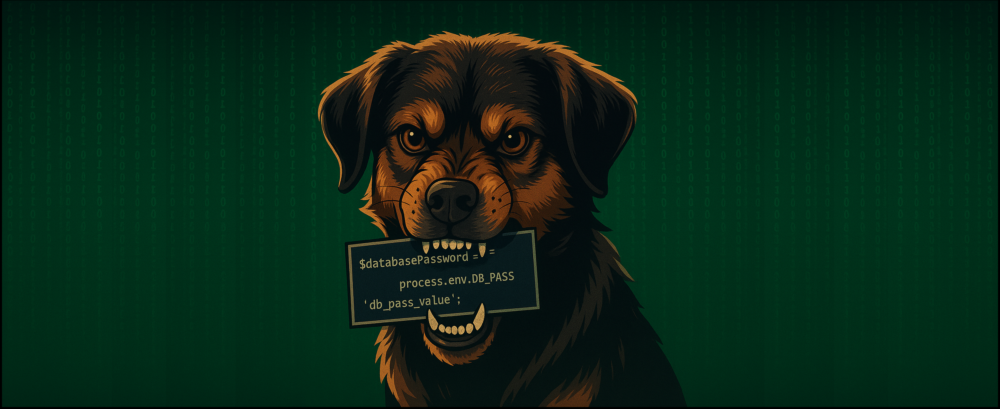

 

  <ul align="center" style="list-style: none;">
    

      <h1>Hi!, I'm Cris ✌️</h1> 
      <h2>Welcome to my Developer Place</h2>
    

  </ul>

## 

  <ul align="center" style="list-style: none;">
    

      <h2>Languages & Frameworks</h2> 
      
    

  </ul>

 

  <ul align="center" style="list-style: none;">
    

      <h2>Tools & Environments</h2> 
      
    

  </ul>

<!-- Crear titulo sin lineas horizontales

  <ul align="center" style="list-style: none;">
    

      ##ITEMS
      ##Ejeplo
      <h2>Tools & Environments</h2> 
      
    

  </ul>

-->

